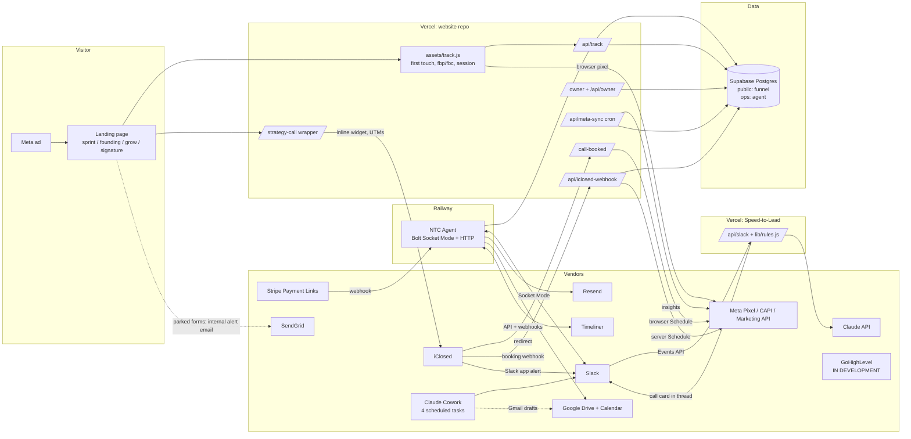
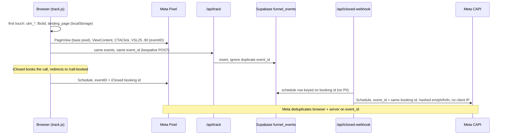
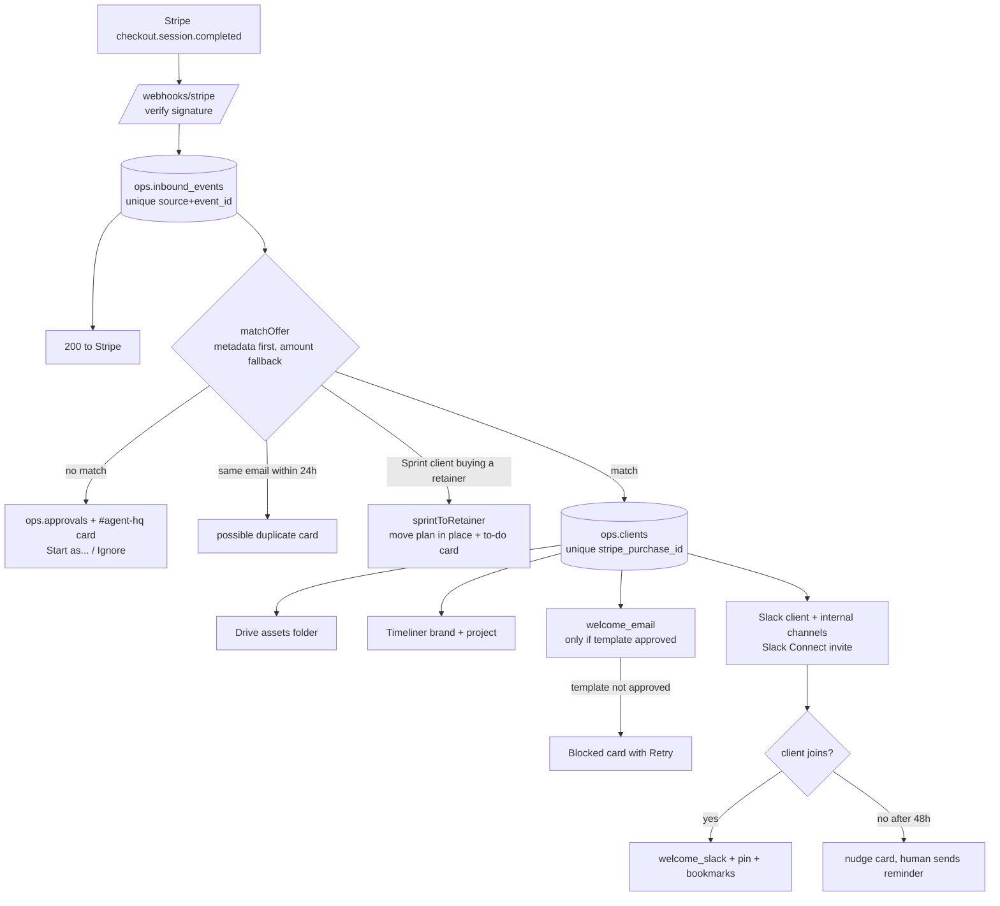

# 01. Architecture

Source of truth: the code in `NewTerrainCreative` (branch `main`, HEAD `ff728c4`, Oct 4 2026) and `ntc-speed-to-lead` (`origin/main` at `de01a27`, `origin/agent-v1` at `c9601e4`, both Oct 4 2026). Secondary evidence: `00-cowork-context-and-rates.md`. Where they disagree, the code wins and the conflict is noted.

Status labels used throughout: `LIVE`, `BUILT, NOT LIVE`, `IN DEVELOPMENT`, `PLANNED`, `ABANDONED`. "Inferred" means the code makes it very likely but the repo alone cannot prove it (for example, whether a migration has been run in production).

---

## 1. The system in one paragraph

New Terrain Creative runs on three deployables and a set of scheduled AI tasks. The **website** is plain static HTML plus a handful of serverless functions on Vercel. It captures attribution, sends conversions to Meta from the browser and the server, stores its own first-party funnel events in Supabase, hands booking to **iClosed**, and gives the owner a password-protected dashboard. **Speed-to-Lead** is one Vercel function that watches iClosed's Slack alerts and asks Claude to write an internal call card. The **NTC Agent** is an always-on Node service on Railway that reacts to Stripe payments, onboards clients through Slack, email, Google Drive and Timeliner, runs the contract-and-payment "close desk", and books shoots, all behind human approval gates. Four **scheduled Claude tasks** (in Claude Cowork, not in either repo) draft lead briefs, a morning brief, inbox replies and Friday recaps. **GoHighLevel** is being built by an outside builder and is not part of the running system yet.

One surprise worth stating plainly for any writer: **the "NTC Agent" contains no AI model calls.** It is a deterministic rule engine with Slack approval buttons. The only model call in either repo is Speed-to-Lead's call card. The AI work otherwise lives in the scheduled Cowork tasks and in how the code was written (most commits are co-authored by Claude models).

## 2. Full-system diagram



## 3. Component inventory

Each component: WHAT, WHY, CONNECTS TO, DATA IN, DATA OUT, IF IT FAILS, CODE, STATUS.

### 3.1 Website and frontend

- **WHAT:** 16 static HTML pages (about 14,500 lines), all CSS and JS inline, two shared browser scripts (`assets/track.js`, `assets/offer.js`). No framework, no `package.json`, no build step.
- **Verified: not Next.js.** `vercel.json` sets `"buildCommand": null`, `"framework": null`, `"outputDirectory": "."`, `"cleanUrls": true`. `.gitignore` still mentions a "future Next.js migration", which never happened.
- **WHY:** speed of iteration. A page is one file an AI coding session can read and edit whole. Nothing to compile, nothing to break in a build.
- **CONNECTS TO:** Meta Pixel, `/api/*`, iClosed widgets, Vimeo Player API, YouTube embeds, Google Fonts.
- **DATA IN:** visitor clicks, UTMs, `fbclid`, form answers on parked forms.
- **DATA OUT:** pixel events, first-party events to `/api/track`, iClosed URL parameters.
- **IF IT FAILS:** pages are static files on Vercel's CDN; the main failure modes are copy drift and broken links, which `scripts/preflight.py` checks (when someone runs it).
- **CODE:** repo root `*.html`, `assets/`.
- **STATUS:** `LIVE`.

| Page | Funnel | Status |
|---|---|---|
| `index.html` | Homepage (organic), routes to Growth, Sprint, Signature | LIVE |
| `grow.html` | Growth retainers (`paid_retainer`); VSL slot is a placeholder | LIVE (VSL PLANNED) |
| `sprint.html` | Ad Sprint paid landing page (`ad_sprint`), Vimeo VSL | LIVE |
| `founding.html` | Founding Three paid landing page (`founding_three`), Vimeo VSL | LIVE |
| `signature.html` | Signature Work (film), created Sep 21 | LIVE |
| `strategy-call.html` | Universal booking wrapper around iClosed, picks the event by `?offer=` | LIVE |
| `call-booked.html` | Post-booking confirmation, fires browser `Schedule` | LIVE (per-offer videos PLANNED) |
| `welcome.html` | Stripe checkout success page, `?plan=` | LIVE (inferred) |
| `onboarding.html` | Client "getting started" guide | LIVE |
| `owner.html` | Owner dashboard | LIVE (inferred, since Oct 3) |
| `apply.html` | Founding two-step application | BUILT, NOT LIVE (parked Sep 21, `9519166`) |
| `project.html` | Signature enquiry form | BUILT, NOT LIVE (parked Sep 23, `b37b13c`) |
| `booked.html` | Older Sprint post-purchase page | ABANDONED in practice (superseded by `/welcome`, inferred) |
| `about.html`, `privacy.html`, `terms.html` | Reference and legal | LIVE |

`vercel.json` also holds 11 redirects (retired pages and old booking URLs go to `/grow` or `/strategy-call`, query strings kept), one cron, noindex headers for `/owner`, and a catch-all rewrite to `index.html` (so there is no real 404 page).

### 3.2 Vercel

- **WHAT:** hosting for two projects: the website (static files plus Node functions in `api/`) and Speed-to-Lead (`api/slack.js`). The 00 file reports Node 24.x for the website and 88 production deploys between Sep 4 and Oct 4.
- **WHY:** git push deploys, preview URLs per branch, built-in cron, marketplace Supabase integration.
- **IF IT FAILS:** both the site and Speed-to-Lead go down; the Railway agent keeps running.
- **Gotchas found the hard way:** env var changes need a redeploy (`ba3360f`, `aac920e`); crons do not run on previews; the Supabase integration prefixes env var names (`c2b6440`).
- **STATUS:** `LIVE`. There is **no CI**: `preflight.py` and the tests are run by hand and do not gate deploys.

### 3.3 Railway

- **WHAT:** one always-on service, `ntc-agent`, built from branch `agent-v1`, root `agent/`. `agent/railway.json`: Nixpacks, `npm start`, healthcheck `/healthz`, restart on failure up to 10 times.
- **WHY:** the agent needs a long-lived process: Slack Socket Mode holds a WebSocket open, and the agent runs its own interval jobs. Serverless functions are a poor fit for that.
- **Also on Railway (00 file, not in either repo):** Postiz, the self-hosted social scheduler for NTC's own accounts at the `post.` subdomain. Elasticsearch and Temporal were stopped to cut cost.
- **STATUS:** `LIVE` (agent, inferred from README and real Slack output in the 00 file).

### 3.4 Supabase and Postgres

One Supabase project, provisioned through the Vercel marketplace. **Preview and production share it**, so test rows land in production tables and are cleaned up by hand (`supabase/cleanup-test-rows.sql`).

Two schemas, two owners:

| Schema | Owner repo | Contents |
|---|---|---|
| `public` | website | `leads`, `funnel_events`, `campaign_daily_metrics`, `sync_status`; views `funnel_by_campaign`, `funnel_by_industry`, `funnel_performance`, `lead_pipeline`; functions `ntc_stamp_sales_stage()`, `owner_funnel_report()`, `meta_sync_replace()` |
| `ops` | agent | 14 tables: `settings`, `offers`, `message_templates`, `clients`, `onboarding_steps`, `shoots`, `deliverables`, `approvals`, `inbound_events`, `client_messages`, `agent_events`, `agreement_templates`, `payment_links`, `agreements`; functions `set_updated_at()`, `check_shoot_date()` |

- **Security model (both schemas):** RLS enabled on every table with **zero policies**, everything revoked from `anon` and `authenticated`, access only through the `service_role` key held server-side. The browser never talks to Supabase. Views use `security_invoker = on` after a `SECURITY DEFINER` view was found bypassing RLS (`42a86eb`).
- **Migrations:** applied by hand in the Supabase SQL editor, no CLI. Website: `0001` to `0008` (1,179 lines) plus verify scripts. Agent: `001` to `036` (2,141 lines). Only `0004` carries an "applied" note in the repo. **Verified in production on Oct 4** from Vercel runtime logs: `0006` is live (signed-in `GET /api/owner` calls return 200, which requires `owner_funnel_report()`), and `0007` and `0008` are live (the 13:00 UTC cron returned `status: ok` through the four-argument `meta_sync_replace()` and wrote `sync_status`). `0005` only redefines the `funnel_performance` view, which nothing in production calls, so it could not be verified from logs; likely applied.
- **Boundary:** the agent writes only `ops` and reads one thing from `public` (`db.findLeadByEmail` on `public.leads`). That boundary is enforced in code, not by database grants (the service-role key could technically write `public`).
- **Unused tables:** `ops.deliverables` and `ops.client_messages` exist for planned flows and no code writes them.
- **IF IT FAILS:** `/api/track` still answers 200 (`stored:false`), so visitors never see an error. The webhook keeps answering iClosed. The agent's `/healthz` returns 503 and Railway restarts it; stuck inbound events are replayed at boot (`recoverStuckEvents`).
- **STATUS:** `LIVE`.

> KEEP PRIVATE: the Supabase project URL and the Meta pixel id appear in SQL comments and one commit message in the website repo. Neither is a secret, but neither belongs in published material.

### 3.5 Auth

There is no auth provider (no Auth0, Clerk or Supabase Auth). **Not used, because** there are no customer logins: clients interact through Slack, email and signed links. Auth is a set of narrow, purpose-built gates:

| Gate | Mechanism | Code |
|---|---|---|
| Owner dashboard | One shared password (`OWNER_DASHBOARD_PASSWORD`, at least 12 chars), compared timing-safe on SHA-256 digests, sets an HMAC-signed `HttpOnly; Secure; SameSite=Strict` cookie scoped to `/api/owner`, 30 days. Rotating the password signs everyone out. In-memory limiter: 5 failures per IP per 15 minutes, per instance. The page itself is public but empty; the API holds the data | `api/owner.js`, `owner.html` (`e8971f6`) |
| Cron | `Authorization: Bearer CRON_SECRET`, timing-safe compare, fails closed | `api/meta-sync.js` |
| iClosed webhook | iClosed offers no signing secret, so a URL key (`?key=` or `x-webhook-key`) must equal `ICLOSED_WEBHOOK_SECRET`; fails closed if unset | `api/iclosed-webhook.js` (`eb85bb1`) |
| Slack to Speed-to-Lead | HMAC-SHA256 signature, 5-minute replay window | `api/slack.js` `verifySlack` |
| Stripe to agent | Stripe signature checked against live and test secrets | `agent/src/http.js`, `stripe.js` `matchStripeSecret` |
| Timeliner to agent | Stripe-style HMAC with a self-registered secret | `agent/src/production.js` |
| Agent buttons | `APPROVER_SLACK_IDS` allowlist; contracts need `CONTRACT_SLACK_IDS` | `agent/src/handlers.js` `denyUnlessApprover`, `agreements.js` `canSendContracts` |
| Agreement pages | 48-hex token in the URL is the credential; GET has no side effects | `agent/src/http.js` `/a/<token>` |

STATUS: `LIVE`.

### 3.6 APIs (website `api/`)

7 routable endpoints and 4 helpers (`_` prefix, not routed), about 2,025 lines, native `fetch` only, no npm dependencies.

| Endpoint | Purpose | Status |
|---|---|---|
| `POST /api/track` | First-party event ingestion with an event allowlist, PII-stripping `safeMetadata()`, and `schedule` reserved (403) | LIVE |
| `POST /api/iclosed-webhook` | Booking to `funnel_events` row and server CAPI `Schedule` | LIVE |
| `GET /api/meta-sync` | Daily Meta spend pull into `campaign_daily_metrics` | LIVE (verified Oct 4; see 3.20) |
| `GET/POST /api/owner` | Dashboard auth and report | LIVE (verified Oct 4) |
| `POST /api/apply` | Founding two-step application | BUILT, NOT LIVE (parked) |
| `POST /api/project` | Signature/Sprint enquiry | BUILT, NOT LIVE (parked) |
| `* /api/strategy-call` | Returns 410 Gone | ABANDONED (tombstone, retired Sep 21 `4eaa70d`) |

Helpers: `_supabase.js` (PostgREST over fetch, env lookup by suffix), `_meta.js` (CAPI sender with hashing), `_offer.js` (offer slug allowlist), `_rates.js` (internal rate card, server-only, imported by nothing).

> KEEP PRIVATE: `api/_rates.js` and the agent's `ops.offers` / `payment_links` hold the internal rate card. Prices were deliberately pulled off the public site on Oct 2 (`1bba59a`).

### 3.7 Environment variables (names only)

**Website:** `SUPABASE_URL`, `SUPABASE_SERVICE_ROLE_KEY` (may arrive with the `sbdata_` prefix; `_supabase.js` matches by suffix), `META_PIXEL_ID`, `META_CAPI_TOKEN`, `META_GRAPH_API_VERSION`, `META_TEST_EVENT_CODE` (preview only), `META_ADS_TOKEN`, `META_ADS_TOKEN_<digits>`, `META_AD_ACCOUNT_ID`, `META_AD_ACCOUNT_IDS`, `CRON_SECRET`, `OWNER_DASHBOARD_PASSWORD`, `ICLOSED_WEBHOOK_SECRET`, `SENDGRID_API_KEY`, `RESEND_API_KEY`, `APPLY_TO`, `APPLY_FROM`, `BOOKING_URL`. Retired: `GOOGLE_SERVICE_ACCOUNT_JSON`, `APPLY_STEP_SECRET`.

**Speed-to-Lead:** `SLACK_BOT_TOKEN`, `SLACK_SIGNING_SECRET`, `ANTHROPIC_API_KEY`, `CLAUDE_MODEL`, `ALERTS_CHANNEL_ID`, `ICLOSED_BOT_ID`, `IGNORE_EVENT_TYPES` (main only).

**NTC Agent (required at boot):** `SLACK_BOT_TOKEN`, `SLACK_APP_TOKEN`, `SUPABASE_URL`, `SUPABASE_SECRET_KEY`, `APPROVER_SLACK_IDS`, `CHANNEL_AGENT_HQ`, `CHANNEL_AGENT_ALERTS`, and at least one of `STRIPE_WEBHOOK_SECRET` / `STRIPE_WEBHOOK_SECRET_TEST`. **Optional:** `ALLOW_TEST_MODE`, `EMAIL_API_KEY`, `EMAIL_FROM`, `EMAIL_REPLY_TO`, `TIMELINER_API_KEY`, `TIMELINER_WEBHOOK_SECRET`, `PUBLIC_URL`, `RAILWAY_PUBLIC_DOMAIN`, `KICKOFF_CALENDAR_ID`, `KICKOFF_EVENT_MATCH`, `KICKOFF_INVITE_EMAILS`, `GOOGLE_SERVICE_ACCOUNT_JSON`, `DRIVE_CLIENTS_FOLDER_ID`, `GOOGLE_CALENDAR_IMPERSONATE`, `CONTRACT_SLACK_IDS`, `NTC_SIGNER_NAME`, `NTC_SIGNER_TITLE`, `NTC_NOTICE_EMAIL`, `NTC_NOTICE_ADDRESS`, `CHANNEL_SALES_DESK`, `CHANNEL_PRODUCTION_DESK`, `TIMEZONE`, `BUSINESS_HOURS`, `NO_JOIN_NUDGE_HOURS`, `SHOOT_MIN_DAYS_AFTER_KICKOFF`, `SHOOT_MIN_DAYS_PRIORITY`, `TEAM_EMAIL_DOMAIN`, a set of link vars (`KICKOFF_BOOKING_LINK`, `INTAKE_LINK`, `BUILD_QUESTIONNAIRE_LINK`, `WELCOME_GUIDE_LINK`, `ASSETS_UPLOAD_LINK`, `VIDEO_LINK_*`), `BUSINESS_PHONE`, `PORT`. **Parsed but unused:** `ANTHROPIC_API_KEY`, `ANTHROPIC_MODEL`, `ANTHROPIC_MODEL_FAST`, `DAILY_TOKEN_BUDGET`, `ACK_AFTER_MINUTES`, `ICLOSED_BOT_ID`.

### 3.8 Meta Pixel, CAPI and attribution



- **WHAT:** `assets/track.js` (282 lines) exposes `window.ntc`: `track`, `trackInternal`, `context`, `attribution`, `metaIds`, `funnelName`, `watchVideo`. First touch wins. `_fbc` is derived from `fbclid` when missing, never invented for organic visitors. `_meta.js` hashes email, phone, names and `external_id` with SHA-256.
- **WHY:** browser pixels lose events to ad blockers and iOS; a server copy with the same `event_id` restores them without double counting. Storing first-party events means the funnel can be measured without trusting any vendor's reporting.
- **Event contract:** browser and server share `event_id` for `Lead` (parked `/project`), `SubmitApplication` (parked `/apply`) and `Schedule` (iClosed booking id, `callPreviewId`). The dedup key was changed from `uuid` to `callPreviewId` because `uuid` double counted (`4079d70`).
- **Offer attribution:** `funnelName()` is path based. `custom_data.offer` splits funnels inside Meta.
- **IF IT FAILS:** CAPI send is fire-and-forget after capture; the sender returns "skipped" with no token. Analytics never errors to the visitor.
- **Known bugs (confirmed from code on Oct 4; the fix is not yet made):**
  1. `iclosed-webhook.js offerFrom()` matches only "founding", "sprint", "growth" or "strategy" in the event name and returns `paid_retainer` for everything else. The Signature event's slug is `signature-project` (`strategy-call.html` `SCHEDULERS`), so **Signature bookings are filed as Growth** unless the event's display name happens to contain one of those words. The live payload carries `event_type.slug`, which would be a more reliable key than the name.
  2. `track.js funnelName()` has no `/signature` case, so **Signature page traffic is filed as `organic_site`**. Together these would leave the dashboard's Signature tab empty.
- **Not used:** GA4 and Google Ads (gtag loads with placeholder ids `G-XXXXXXXXXX` / `AW-XXXXXXXXXX` on three pages, yet `privacy.html` discloses both), GTM, TikTok pixel, any `Purchase` event (allowlisted, "not yet wired").
- **STATUS:** Pixel, CAPI, first-party events `LIVE`. GA4/Google Ads `PLANNED` (stub). Purchase conversion `PLANNED`.

### 3.9 iClosed (booking)

- **WHAT:** SaaS scheduler that owns the qualification questions, Google Calendar availability, confirmations, reminders and SMS reminders, plus its own Slack app posting to the alerts channel.
- **WHY:** the custom booking path cost a lot of effort for a worse result (see 04). iClosed replaced a 13-question custom form on Sep 21 (`4eaa70d`).
- **CONNECTS TO:** `strategy-call.html` (`SCHEDULERS` map: founding-three, signature, production-media, ad-sprint, plus a growth default; first-touch UTMs, `fbclid`, `landing_page` and `ntc_session` passed in `data-url`), `/call-booked` redirect, the website webhook, Slack (which feeds Speed-to-Lead).
- **Limits:** iClosed's own Meta CAPI integration rejected a token Meta accepts (`f2a9f1c`), so NTC sends `Schedule` itself. Auto-disqualify needs iClosed's Business plan, so agents score leads from form answers instead (00 file).
- **IF IT FAILS:** no new bookings. The webhook always answers 200 after auth so iClosed never disables it.
- **STATUS:** `LIVE`.

### 3.10 GoHighLevel (CRM)

- **What exists:** nothing in either repo. **Known cost:** the outside builder's quote is $1,600 (scope and timeline not yet confirmed). Zero references to GoHighLevel, GHL or `app.newterraincreative.com` in code, docs, migrations or env on any branch.
- **Target architecture (00 file, not built here):** a white-labeled agency login at `app.newterraincreative.com` with one sub-account per client, deployed from a reusable master snapshot produced by an outside builder. First planned deployment: a pilot client. NTC's own internal CRM in GHL is out of scope for now.
- **Adjacent hook:** every retainer client receives `BUILD_QUESTIONNAIRE_LINK` (the "Funnel + CRM build questionnaire", created by `agent/forms/ntc_forms.gs`). That questionnaire is the intake a GHL build would consume. There is no GHL onboarding step in the agent's `STEP_KEYS`.
- **What NTC does have instead of a CRM:** `public.leads` with a `sales_stage` column and stamping trigger (`0003`, updated by hand, nothing in code writes it), iClosed's own contact records, and `ops.clients` for paying clients.
- **STATUS:** `IN DEVELOPMENT`. Do not describe it as deployed, validated or AI-built.

### 3.11 Stripe and payment links

- **WHAT:** Stripe Payment Links (one per sellable plan, plus Front of the Line add-ons and annual plans). The agent never calls the Stripe API; it only receives webhooks. The close desk links to pre-made Payment Links (host must be `*.stripe.com`), with an optional `prefilled_promo_code` for Sprint credit.
- **WHY no Stripe API:** "no money actions" is a non-negotiable in `AGENT_SPEC.md`. Building it in by construction is safer than a rule.
- **Data in:** `checkout.session.completed`, invoice, subscription and failure events. **Data out:** `ops.clients` rows, onboarding, alerts. Website side: each Payment Link redirects to `/welcome?plan=<id>` (configured in Stripe by hand).
- **IF IT FAILS:** events are stored first in `ops.inbound_events` (unique on source and event id), acknowledged, then processed; Stripe retries on 500; stuck rows are replayed at boot.
- **CODE:** `agent/src/stripe.js`, `billing.js`, `offers.js`, `onboarding.js`.
- **STATUS:** `LIVE` (inferred). Several payment links and order-form rows are **awaiting Jadon's re-approval** after migrations 023 to 035 reset them.

### 3.12 Webhooks (all)

| Webhook | Receiver | Verification | Idempotency |
|---|---|---|---|
| iClosed booking | `api/iclosed-webhook.js` | URL key | `funnel_events.event_id` unique = booking id |
| Slack Events | `ntc-speed-to-lead api/slack.js` | Slack HMAC | ignores Slack retries |
| Stripe | agent `/webhooks/stripe` | Stripe signature (live + test secrets) | `ops.inbound_events (source, event_id)` unique; `clients.stripe_purchase_id` unique |
| Timeliner | agent `/webhooks/timeliner` | HMAC, secret self-registered and rotated at boot | same store-first pattern |

### 3.13 Slack

- **Speed-to-Lead:** reads the iClosed alerts channel via the Events API, posts a call card as a thread reply.
- **NTC Agent:** Bolt app in Socket Mode (no public Slack URL). 13 button handlers, 3 modal submissions, 4 event handlers, a Home tab. Posts under four display identities (Sales, Client Success, Production, Ops) via `chat:write.customize`. Creates a private client channel plus an internal channel per client and sends a **Slack Connect** invite (Slack Pro plan required).
- **Internal channels:** `#agent-hq` (decisions and cards), `#agent-alerts` (one-liners, iClosed alerts), `#sales-desk`, `#production-desk`, plus Cowork's `#agent-research`.
- **Lesson baked in:** a bot never invited to a channel has its posts silently dropped; `/healthz` now reports channel membership (`d3f757a`, `e137737`).
- **STATUS:** `LIVE`. Client-facing replies (Flow C) `PLANNED`.

### 3.14 Email

| Sender | Used by | Status |
|---|---|---|
| SendGrid (raw REST `v3/mail/send`) | website `api/apply.js`, `api/project.js`, internal alerts only | BUILT, NOT LIVE in practice (both forms parked) |
| Resend | website fallback in `api/apply.js`; **the agent's only email provider** (`agent/src/email.js`, HTML + text, attachments for signed PDFs) | LIVE (agent) |

**Conflict with the 00 file:** it says "SendGrid then Resend". Git shows Resend first (`9bd2f6a`), then SendGrid added (`311eda1`) and kept for the website, both Sep 10. The agent separately chose Resend. The agent sends from the business inbox, which needs SPF/DMARC on the domain (00 file).

### 3.15 SMS

**Not used.** `leads.sms_consent` and a TCPA-worded checkbox exist on the parked `/apply` form, a Twilio domain-verification file is deployed, and A2P 10DLC registration was started. There is no code that sends a text. iClosed sends its own SMS reminders. The unmerged branch `feat/lead-booking-automation` (`b182a56`) built SMS behind two off switches and was abandoned with the rest of the custom booking path. Status: `ABANDONED` (custom SMS); iClosed SMS reminders `LIVE` (vendor feature).

### 3.16 Production tools: Timeliner, Clipflow, Google Drive

- **Google Drive:** the agent creates a per-client brand-assets folder in a Shared Drive and shares it (`agent/src/drive.js`, service-account JWT signed with `node:crypto`), and files the signed agreement PDF there. `LIVE` if configured.
- **Timeliner:** on payment the agent creates a Timeliner brand, project and review link; Timeliner webhooks (uploads, comments, tasks, share opened) post internal lines; shoot bookings create a Timeliner task. No deletes. `agent/src/timeliner.js`, `production.js`, migrations `013`, `015`. Status: `BUILT, NOT LIVE` as a standard; in pilot with a go/no-go on Oct 26 (00 file).
- **Clipflow:** the incumbent review tool. Not in either repo; webhooks only, no API (00 file). Handbook v1.15 still names it the current review tool. Status: `LIVE` as a manual tool, no integration.

### 3.17 `/owner` dashboard

- **WHAT:** a private funnel dashboard: offer tabs, date range, KPI tiles (ad spend, cost per booking), funnel steps Landing, Play, Watched 25/50/75/90, CTA click, Lead, Booked, a per-campaign/ad table, and a health panel (site tracking, VSL tracking, iClosed bookings, Meta sync stale after 36 hours).
- **WHY:** one place to see spend and bookings by offer without logging into three vendors.
- **Design rule worth teaching:** coverage-aware numbers. A figure for a period before an event was first recorded shows as unavailable, not zero, and missing spend shows as unavailable, not $0.
- **DATA:** `owner_funnel_report(p_from, p_to, p_tz)` (migration `0006`), aggregates only, plus the oldest `sync_status` row.
- **Known gap:** the report sums every ad account; it needs an account filter before a second account is added.
- **CODE:** `owner.html`, `api/owner.js`, `supabase/migrations/0006_owner_dashboard.sql`, `scripts/test-owner.mjs` (37 checks).
- **STATUS:** `LIVE` (inferred, Oct 3 `e8971f6`).

### 3.18 Booking and onboarding (summary; full traces in 02)

- **Booking:** iClosed (sales calls), Google Calendar kickoff events polled by the agent every 15 minutes, shoots booked by a human through an agent modal.
- **Onboarding:** Stripe payment triggers Flow A in the agent (channels, welcome email, Drive folder, Timeliner project); `/welcome` and `/onboarding` pages on the website; two Google Forms (intake, build questionnaire).

### 3.19 External APIs used

Meta Graph (CAPI, Marketing API insights), iClosed (widgets in, webhook out), Slack Web API and Events API, Stripe (webhooks only), Resend, SendGrid, Google Drive and Calendar (service account), Timeliner partner API, Anthropic Messages API (Speed-to-Lead only), Vimeo Player API, YouTube embeds.

### 3.20 Crons and scheduled jobs

| Job | Where | Schedule | Status |
|---|---|---|---|
| Meta spend sync | Vercel Cron `/api/meta-sync` | `0 13 * * *` UTC; 90-day backfill on first run, then trailing 7 days | LIVE (verified Oct 4: `status ok`, but `fetched: 0` for the 90-day window) |
| No-join nudge + close desk card upkeep | agent `setInterval` | hourly + at boot | LIVE |
| Kickoff calendar sweep | agent `setInterval` | every 15 min + at boot | LIVE |
| Stuck event recovery, Timeliner webhook registration | agent boot | at boot | LIVE |
| NTC Lead Prep | Claude Cowork | 7am, noon, 5pm PT daily | LIVE (00 file) |
| NTC Chief of Staff Brief | Claude Cowork | 8am PT weekdays | LIVE (00 file) |
| NTC Inbox Triage | Claude Cowork | 11am, 3pm PT weekdays | LIVE (00 file) |
| NTC Friday Client Recap | Claude Cowork | Fridays 11am PT | LIVE (00 file) |
| 15-min heartbeat, daily summary, Stripe reconciliation | agent spec Phase 3 | n/a | PLANNED |

### 3.21 AI agents (summary; full detail in 03)

| System | AI? | Status |
|---|---|---|
| Speed-to-Lead call card | Yes: one Claude Messages API call per alert, no tools, internal output only | LIVE |
| NTC Agent (Railway) | **No model calls**; rule engine with approvals | LIVE (Phase 1) |
| Four Cowork scheduled tasks | Yes: Claude with the Handbook preamble, drafts and briefs only | LIVE (00 file) |
| Agent Flow C (classify client messages), reply parsing | Would use Claude (`ANTHROPIC_MODEL_FAST` configured) | PLANNED |

### 3.22 Alerts

Agent `alerts.js`: `opsLine` (one-liners to `#agent-alerts`), `hqPost` and `stepProblem` (cards with Retry to `#agent-hq`). Speed-to-Lead posts a fallback line if it cannot build a card. Cowork Inbox Triage posts URGENT items to `#agent-alerts`. The dashboard shows stale-sync and stale-tracking warnings. There is no paging or on-call; alerts are Slack only.

### 3.23 Production checks (Oct 4 2026)

Read-only checks against production: unauthenticated requests to the live endpoints, and Vercel runtime logs for the `new-terrain-creative` project. No credentials were used and nothing was triggered.

| Question | Finding | Evidence |
|---|---|---|
| Is the owner dashboard live? | **Yes.** `OWNER_DASHBOARD_PASSWORD` is set (unauthenticated `GET /api/owner` returns 401, not 503), and signed-in sessions load the report (several `GET /api/owner` 200s on Oct 3, after a `POST` sign-in) | live probe; runtime logs |
| Is the Meta spend sync running? | **Yes, but it returns no data.** `CRON_SECRET` is set (401 without it). The Oct 4 13:00 UTC run logged `status: ok`, a 90-day window, Meta HTTP 200, and `fetched: 0, inserted: 0` | runtime log line `meta-sync {...}` |
| Are migrations `0005` to `0008` live? | `0006`, `0007`, `0008`: **yes** (code paths that require them succeeded). `0005`: not verifiable from logs, likely | as above |
| Are bookings reaching the webhook? | **Yes.** Oct 3 23:30: a booking stored and `Schedule` sent to Meta; 23:35: the same call cancelled and noted | runtime logs |
| Anything wrong with the webhook? | **Two deliveries rejected with "bad key"** (Oct 3 23:02 and Oct 4 00:07 UTC). Likely a second or older iClosed webhook configured with an outdated URL key. Those bookings did not reach Meta server-side | runtime logs |
| Is Signature attribution wrong? | **Yes, confirmed from code** (3.8) | `api/iclosed-webhook.js offerFrom()`, `assets/track.js funnelName()` |
| Which close-desk texts are approved? | **Not checkable from here.** The approval flags live in Supabase `ops` tables, which these checks cannot read | see README for the read-only SQL |

Why "fetched: 0" matters: either no ads ran in the configured ad account in the last 90 days, or the account id or token points at the wrong account. Until it returns rows, the dashboard's spend and cost-per-booking figures will read "unavailable".

## 4. Subsystem diagrams

### 4.1 Payment to onboarding (Flow A)



### 4.2 Close desk

```mermaid
sequenceDiagram
  participant J as Jadon (CONTRACT_SLACK_IDS)
  participant A as NTC Agent
  participant C as Client
  participant S as Stripe
  J->>A: Close desk modal (plan, contact, Sprint credit?)
  A->>A: require approved master MSA, order form row, payment link; refuse [CONFIRM or {{var}}
  A->>A: snapshot text + SHA-256 into ops.agreements
  A-->>J: Close link ready [Void link]
  A->>C: optional close_link_email (approved template)
  C->>A: GET /a/<token> (no side effects)
  C->>A: POST /a/<token>/sign (name, title, address; IP, UA, time recorded once)
  A->>C: 303 to Stripe Payment Link
  C->>S: pays
  S->>A: webhook; attachAgreement links agreement to client, files PDF to Drive, emails copy
```

## 5. Production status summary

| Component | Status |
|---|---|
| Static site, tracking, CAPI, first-party events | LIVE |
| iClosed booking + webhook | LIVE |
| Owner dashboard, Meta spend sync | LIVE (verified Oct 4 from Vercel logs; the sync currently returns 0 rows of ad data) |
| Speed-to-Lead | LIVE |
| Agent Phase 1: Flow A, billing alerts, internal alerts | LIVE (inferred) |
| Close desk, Front of the Line, Sprint credit, annual plans | BUILT, NOT LIVE until text re-approved |
| Flow B shoot booking | LIVE (exercised on a real booking, `31f861c`) |
| Timeliner | BUILT, in pilot |
| Four Cowork scheduled tasks | LIVE (00 file) |
| Flow C, agent AI, iClosed takeover, heartbeat, deliverables tracking | PLANNED |
| GoHighLevel | IN DEVELOPMENT (outside both repos) |
| `/apply`, `/project` | BUILT, NOT LIVE (parked) |
| Custom strategy-call funnel, custom calendar polling, custom SMS, Notion OS as hub, Vercel Workflow agents | ABANDONED |
| GA4, Google Ads, Purchase conversion | PLANNED |
| CI | Not used (preflight and tests are manual) |

**Merge risk to note:** `agent-v1` has never been merged to `main` in `ntc-speed-to-lead`. Its copy of `api/slack.js` lacks main's kickoff-ignore filter (`3225303`). A naive merge would reintroduce kickoff bookings being treated as leads.
