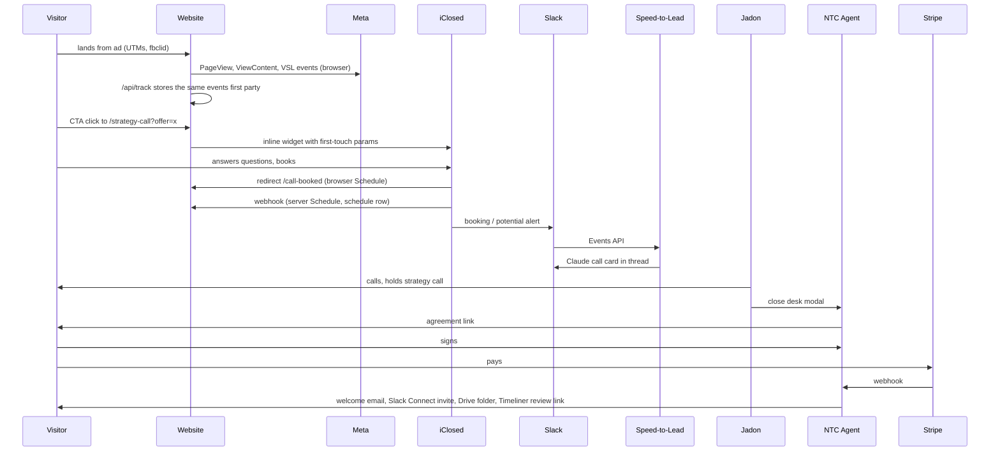
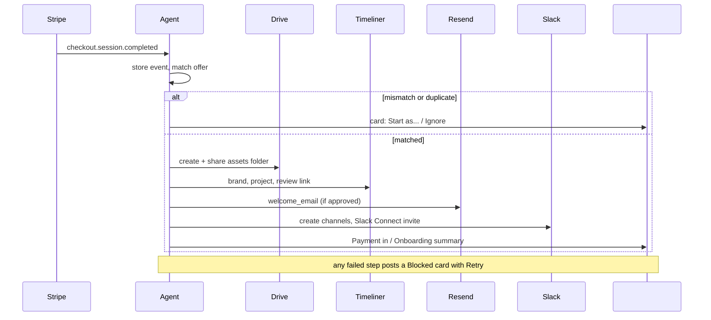

# 02. Workflows

Every step is marked with one of four automation levels:

- **AUTO**: fully automated, no human in the loop.
- **AI**: an AI model drafts or decides something; a human uses or approves the output.
- **APPROVED**: the system prepares the action and a human presses the button or submits the form before anything reaches a client.
- **HUMAN**: entirely human, no system support beyond tools like email and calendar.

Code locations: `web:` is the `NewTerrainCreative` repo, `stl:` is `ntc-speed-to-lead` `main`, `agent:` is `ntc-speed-to-lead` `agent-v1` under `agent/`, `cowork:` is a Claude Cowork scheduled task (not in either repo).

---

## 1. The master trace: ad impression to retention

| # | Step | Level | What happens | Code | Data touched |
|---|---|---|---|---|---|
| 1 | Ad impression and click | HUMAN (campaign setup) / AUTO (delivery) | Meta serves the ad; UTMs follow the template `utm_campaign={{campaign.name}}&utm_content={{ad.name}}` (docs/ANALYTICS.md) | Meta Ads Manager | Meta |
| 2 | Landing page view | AUTO | Base pixel fires `PageView`; `track.js` stores first-touch UTMs, `fbclid`, landing page, referrer in `localStorage.ntc_attribution`; session id in `ntc_sid`; page fires `ViewContent` | `web: assets/track.js`, page inline script | browser storage, `public.funnel_events` via `/api/track` |
| 3 | Video engagement | AUTO | Vimeo VSL is a poster until clicked; the click builds the player with sound and emits `vslstart`, which fires `VSLPlay` and attaches `watchVideo` for `VSL25/50/75/90` | `web: sprint.html`, `founding.html` VSL scripts, `track.js watchVideo` | `funnel_events` (`vsl_play`, `vsl_25`..`vsl_90`) |
| 4 | CTA click | AUTO | `CTAClick` (custom event, not a standard conversion, on purpose) with `offer` and `position` | page inline script | `funnel_events` (`cta_click`) |
| 5 | Form / lead | AUTO (vendor) | `/strategy-call?offer=...` mounts the matching iClosed event and passes first-touch UTMs, `fbclid`, `landing_page`, `ntc_session`. iClosed asks its qualification questions. NTC fires **no** Lead here because its `event_id` cannot dedupe against iClosed's (`4eaa70d`) | `web: strategy-call.html SCHEDULERS` | iClosed |
| 6 | Attribution | AUTO | First touch persisted from step 2 travels into iClosed; webhook copies any UTMs it receives into the booking row's metadata | `track.js`, `api/iclosed-webhook.js` | `funnel_events.metadata` |
| 7 | Booking | AUTO | iClosed books against Google Calendar, redirects to `/call-booked?offer=...`; the page waits for the iClosed card to render, then fires browser `Schedule` with `eventID` = booking id. In parallel the iClosed webhook stores a PII-free `schedule` row and sends server `Schedule` with the same id | `web: call-booked.html`, `api/iclosed-webhook.js` | `funnel_events`, Meta |
| 8 | Slack notification | AUTO + AI | iClosed's Slack app posts the booking or "potential" alert in the alerts channel. For "potential" and "cancelled" alerts, Speed-to-Lead makes one Claude call and posts an internal call card in the thread | `stl: api/slack.js`, `lib/rules.js` | Slack only |
| 9 | Speed-to-lead call | HUMAN | Jadon calls or texts using the card (Who / Fit / Opener / Ask / Book / text-if-no-answer / Heads-up). Nothing is sent to the lead automatically | none | none |
| 10 | Lead research brief | AI | Cowork "NTC Lead Prep" posts briefs with fit signals in `#agent-research` (7am, noon, 5pm PT). Never tells a lead they are disqualified | `cowork` | Slack |
| 11 | Sales call | HUMAN | Strategy call over iClosed's calendar link | none | none |
| 12 | Agreement and close link | APPROVED | Only `CONTRACT_SLACK_IDS` (Jadon) can open the close desk modal. Agent assembles approved MSA + Order Form text, snapshots it with SHA-256, returns a link. Optional email uses the approved `close_link_email` | `agent: src/agreements.js createCloseLink`, `handlers.js close_open/close_submit/close_void` | `ops.agreements`, `agreement_templates`, `payment_links` |
| 13 | Client signs | AUTO (client action) | Agreement page records typed name, title, notice address, time, IP and user agent once, then 303s to the Stripe Payment Link | `agent: src/http.js /a/<token>/sign`, `agreements.js signAgreement` | `ops.agreements.signed_*` |
| 14 | Stripe payment | AUTO (client action) | Client pays via Payment Link; Stripe redirects to `/welcome?plan=<id>` | Stripe (configured by hand), `web: welcome.html` | Stripe |
| 15 | Payment received | AUTO | Webhook stored first, acknowledged, processed: offer matched, client created (or duplicate/mismatch card raised for a human), agreement attached and PDF filed to Drive | `agent: src/stripe.js`, `onboarding.js handleStripeEvent`, `offers.js matchOffer`, `agreements.js attachAgreement` | `ops.inbound_events`, `clients`, `agreements`, `agent_events` |
| 16 | Onboarding day 0 | AUTO (template-gated) | Drive folder, Timeliner project, welcome email (only if `welcome_email` is approved), Slack Connect channels and invite | `agent: onboarding.js startOnboarding, runStep` | `ops.onboarding_steps`, Drive, Timeliner, Resend, Slack |
| 17 | Client communication | APPROVED / HUMAN / AI drafts | Welcome Slack post on join (approved template); nudges need a button; everything after day 0 is done by people (Handbook v1.15 section 2c). Cowork drafts inbox replies and Friday recaps as Gmail drafts | `agent: onMemberJoined, sweepNoJoin`; `cowork` | Slack, Gmail drafts |
| 18 | Production | APPROVED + HUMAN | Kickoff detected from the calendar; human offers shoot dates, client replies, human books via modal; agent confirms with approved template, creates Timeliner task and calendar event. Shooting and editing are human | `agent: kickoff.js`, `shoots.js` | `ops.shoots`, `onboarding_steps` |
| 19 | Approvals (creative) | HUMAN | Client reviews cuts in Timeliner (pilot) or Clipflow; Timeliner events post internal lines | `agent: production.js` | Slack internal channel |
| 20 | Reporting | AUTO (internal) / HUMAN (client) | Owner dashboard aggregates funnel and spend. Client reporting is human; Cowork drafts the Friday recap with `[confirm: ...]` tags | `web: owner.html`, `api/owner.js`, `api/meta-sync.js`; `cowork` | `public.*` |
| 21 | Retention / upsell | HUMAN + AUTO | Sprint-to-retainer: Jadon sends a close link with Sprint credit; on payment the agent moves the client's plan in place and posts the hand-done to-dos. Renewals post a one-liner. Billing problems are alerts only | `agent: onboarding.js sprintToRetainer`, `billing.js` | `ops.clients` |

---

## 2. By offer

### 2.1 Growth leads (retainers: The Anchor, Growth Partner, Brand Builder)

| Step | Level | Notes / code |
|---|---|---|
| Land on `/grow` | AUTO | `funnelName()` gives `paid_retainer`. VSL slot is a placeholder (`PLANNED`) |
| CTA to `/strategy-call` (no `offer`) | AUTO | `DEFAULT_SCHEDULER` is the growth event |
| iClosed form | AUTO (vendor) | Budget ranges map to a *suggested* offer, never a qualification; nothing sent to a lead may repeat a price |
| Booking, webhook | AUTO | `offerFrom()` maps "growth" or "strategy" to `paid_retainer` |
| Call card | AI | `lib/rules.js` maps budget ranges to retainer tiers; says paid media is Meta, only Brand Builder goes beyond (`de01a27`) |
| Close + pay + onboarding | APPROVED then AUTO | Welcome email includes the build questionnaire (funnel + CRM intake) and Meta access asks |
| Kickoff, monthly production, recaps | HUMAN with AI drafts | Friday recap drafted by Cowork |

### 2.2 Ad Sprint leads (The Eight, The Fifteen)

| Step | Level | Notes / code |
|---|---|---|
| Land on `/sprint` | AUTO | `ad_sprint`; Vimeo VSL |
| CTA to `/strategy-call?offer=ad-sprint[&pkg=eight\|fifteen]` | AUTO | The `?offer=` allowlist exists because Sprint visitors used to be counted as retainer leads (`2eb842f`) |
| iClosed Sprint event, webhook | AUTO | "sprint" maps to `ad_sprint` |
| Call card | AI | Sprint budget ranges re-cut to new prices on Oct 2 to 4 (`dedc7bb`, `62813ee`) |
| Close + pay | APPROVED then AUTO | Front of the Line add-on recognised from link metadata or a cross-sell total (`cc0d0b6`, migration `031`) |
| Onboarding | AUTO (template-gated) | Sprint welcome copy drops Friday recaps and ad-access asks (`templateFlags`, migrations `027`, `033`); Sprints book an "Angle Call" (`035`, `036`) |
| Shoot window | AUTO enforcement | 7 days after kickoff, 3 days with Front of the Line, enforced in the modal and the DB trigger (`034`) |
| Delivery | HUMAN | Three-week cadence, 14 days with Front of the Line |

### 2.3 Founding Three leads

| Step | Level | Notes / code |
|---|---|---|
| Land on `/founding` | AUTO | `founding_three`; Vimeo VSL |
| CTA to `/strategy-call?offer=founding-three` | AUTO | `/apply` (24 questions, then 9 more to book) parked Sep 21 (`9519166`); preflight fails if anything links `/apply` again |
| iClosed Founding event | AUTO (vendor) | Continuation price disclosed in the required terms acknowledgement on the iClosed form and in the VSL, never in page copy (`assets/offer.js` comments) |
| Selection | HUMAN | "We review every application personally"; slot counter edited by hand in `founding.html` |
| Close + pay | APPROVED then AUTO | Month-one service fee waived; client funds ad spend |
| Onboarding | AUTO (template-gated) + HUMAN | Same Flow A |

### 2.4 Signature leads (film)

| Step | Level | Notes / code |
|---|---|---|
| Land on `/signature` | AUTO | Files as `signature_work` (before the Oct 4 fix, `dc2c996`, events filed as `organic_site`) |
| CTA to `/strategy-call?offer=signature` | AUTO | `/project` enquiry form parked Sep 23 (`b37b13c`) |
| Webhook | AUTO | `offerFrom()` matches `signature` in the event name or slug (before the Oct 4 fix, Signature bookings filed as Growth) |
| Quote, contract, production | HUMAN | Signature is bespoke; no Payment Link flow is evident in the agent catalog for it (inferred) |

---

## 3. Client onboarding, day 0 to day 7

| Day | Step | Level | Code / data |
|---|---|---|---|
| 0 | Payment matched to an offer | AUTO, or APPROVED on mismatch/duplicate | `offers.js matchOffer`, `paymentMismatch`, `possibleDuplicate` |
| 0 | `ops.clients` row (one per Stripe purchase) | AUTO | unique `stripe_purchase_id` (`005`) |
| 0 | Drive brand-assets folder, shared with client | AUTO | `ensureAssetsFolder` |
| 0 | Timeliner brand + project + review link | AUTO (pilot) | `ensureTimelinerProject` |
| 0 | Welcome email with prefilled intake / questionnaire links | AUTO, template-gated | `sendTemplateEmail`, `prefill.js`, `templates.js` |
| 0 | Slack client + internal channels, Slack Connect invite | AUTO | `ensureChannelsAndInvite` |
| 0 | Personal text from the team | HUMAN | Handbook 2c |
| 0 | Summary line: "Onboarding for <Client>: 4 of 6 steps done, 2 skipped." | AUTO | `startOnboarding` |
| 0 to 2 | Client joins Slack: welcome post, pin, bookmarks, topic | AUTO, template-gated | `onMemberJoined` |
| 2+ | No join after 48h: card, human sends approved reminder | APPROVED | `sweepNoJoin`, `resolveNudge` |
| 1 to 3 | Kickoff / Angle Call booked on Google Calendar | HUMAN (client books) / AUTO (detected) | `kickoff.js sweepKickoffs` every 15 min; marks `kickoff_done` after the event and posts the shoot card |
| 1 to 7 | Intake form, build questionnaire, ad-account partner access | HUMAN (client) | Google Forms from `agent/forms/ntc_forms.gs`; `web: onboarding.html` guide |
| 7 | Scripts approved, shoot booked | APPROVED | `shoots.js` (Flow B) |

Known gaps (00 file, consistent with code): kickoff bookings do not always reach the agent (title-match polling via `KICKOFF_EVENT_MATCH`); Slack Connect drop-off is the biggest onboarding risk; nothing replies to client Slack messages yet. The day-7 "quick win" was removed from the Handbook (`f437290`).

---

## 4. Sales desk and close desk

- **Sales desk (`#sales-desk`):** where close-link announcements and sales-identity posts land. There is no lead pipeline in Slack and no CRM; lead status lives in iClosed and, for the parked forms, `public.leads.sales_stage` (updated by hand).
- **Close desk:** a pinned card and bookmark (`ensureCloseCard`, `ensureCloseBookmark`, hourly upkeep) open the modal. Steps: APPROVED (Jadon creates), AUTO (snapshot, link, page), AUTO client sign, AUTO attach + file on payment. "Paid without an agreement" raises a card with "Create sign-only link" (APPROVED).
- **Not a real e-sign vendor:** typed-name signature with IP, user agent, timestamp and a SHA-256 of the exact text, plus a PDF copy (`agent/src/pdf.js`, a hand-written PDF writer). There is no third-party audit certificate.

> KEEP PRIVATE: the MSA and Order Form text in `ops.agreement_templates` (migrations `020`, `025`, `029`, `030`, `035`).

## 5. Payment and billing events

| Event | Level | Behaviour | Code |
|---|---|---|---|
| Checkout completed | AUTO | Flow A | `onboarding.js` |
| Renewal invoice paid | AUTO | One-liner | `handleStripeEvent` (billing_reason) |
| Subscription paused / resumed / canceled | AUTO alert | Updates `clients.status`, posts alert; any action in Stripe is HUMAN | `billing.js` |
| Payment failed, async failed, checkout expired | AUTO alert | Alert only | `billing.js` |
| Plan changed | AUTO | Re-matched (`subscriptionPlanChanged`) | `billing.js` |
| Sprint credit discount | AUTO validation | Accepted only if equal to a Sprint price (annual) or a third of it (monthly); anything else is a mismatch | `offers.js isSprintCredit` |

The agent never refunds, discounts, retries or cancels anything. That is by construction: there is no Stripe API client.

## 6. Lead follow-up

| Step | Level |
|---|---|
| iClosed confirmations and reminders (email, SMS) | AUTO (vendor) |
| Call card on potential/cancelled alerts | AI |
| Call or text to the lead | HUMAN |
| Lead briefs three times a day | AI (Cowork) |
| Inbox triage and reply drafts | AI drafts, HUMAN sends (Gmail drafts are the approval queue) |
| Automated nurture sequences, SMS from NTC | Not used |

## 7. Production and shoot booking (Flow B)

1. Kickoff ends: AUTO detection posts a shoot card (`kickoff.js`).
2. Approver offers dates: APPROVED (`shoot_offer_open` / `shoot_offer_submit`, approved `shoot_date_offer` template).
3. Client replies in Slack: AUTO relay of the reply **verbatim** to `#agent-hq` (`relayShootReply`). The agent never picks or parses a date.
4. Approver books: APPROVED (`shoot_book_submit`), date checked against the 7-day (or 3-day) rule in the form and by `ops.check_shoot_date`.
5. Side effects: AUTO and isolated. Approved `shoot_confirmed` to the client, `shoot_booked` step, Timeliner task, all-day calendar event (saved without guests, because Google refused service-account invites, `31f861c`), lines to `#production-desk` and the internal channel. The card lists what did and did not happen ("Client NOT told: they have not joined their Slack channel").
6. Change or cancel: APPROVED. Cancel deletes the internal calendar event (the one place the agent deletes anything).
7. Shoot, edit, review: HUMAN. Timeliner events post internal lines (AUTO, internal only). A `first_cut_ready` template is seeded but no flow sends it (PLANNED).

## 8. Sprint-to-retainer upgrade

1. HUMAN: Jadon creates a single-use Stripe promo code.
2. APPROVED: close link with "Sprint credit"; clause from the approved `sprint_credit_monthly` or `sprint_credit_annual` template, promo code prefilled on the Payment Link.
3. AUTO: on payment, `sprintToRetainer` updates the existing Sprint client in place (offer, add-ons, purchase id), validates the credit, posts to `#agent-alerts`.
4. AUTO: `#agent-hq` card listing hand-done steps (build questionnaire, retainer kickoff link, ad-account access). Nothing goes to the client automatically.
5. HUMAN: those steps.

Built Oct 3 (`f6324df`, migration `035`). Status `BUILT, NOT LIVE` until the clause templates are approved.

## 9. Reporting and analytics

| Layer | Level | Code |
|---|---|---|
| First-party event capture | AUTO | `api/track.js`, `funnel_events` |
| Meta spend pull | AUTO daily | `api/meta-sync.js`, `meta_sync_replace()`; offer attribution inside SQL from the most common `view_content.funnel` per campaign and ad, then campaign name |
| Owner dashboard | AUTO | `owner_funnel_report()` |
| Sales stage tracking | HUMAN (SQL by hand) | `leads.sales_stage`, trigger `ntc_stamp_sales_stage()` |
| Closed-won / Purchase to Meta | PLANNED | allowlisted, not wired |
| Client performance reports | HUMAN with AI drafts | Cowork Friday recap; day-30 written read for Founding |

## 10. Internal Slack alerts

| Source | Channel | Example (sanitized, from the 00 file) |
|---|---|---|
| Agent `opsLine` | `#agent-alerts` | `Payment in from <Client>, $X Ad Sprint (The Eight). Onboarding started.` |
| Agent `stepProblem` | `#agent-hq` | `*Blocked:* welcome_sent for *<Client>*. Template welcome_email is not approved. [Retry]` |
| Agent close desk | `#agent-hq` | `*Close link ready* for <Client>. They sign, then go straight to checkout. [Void link]` |
| Agent nudge | `#agent-hq` | `*No Slack join yet:* <Client> was invited 49 hours ago and hasn't accepted. Send the reminder?` |
| Agent Flow B | `#agent-hq` | `*Shoot booked* ... Client NOT told: they have not joined their Slack channel. Calendar event NOT set: 403 ...` |
| Speed-to-Lead | alerts thread | call card, or a fallback "couldn't build a call card" line |
| Cowork Inbox Triage | `#agent-alerts` | `URGENT (low risk) · Inbox triage 3pm · unmatched sender, no draft written ... Handbook gap: ...` |
| Cowork Chief of Staff | `#agent-hq` | Today / Needs you (each with "Next:") / Onboarding / Leads / Waiting on others / One suggestion |

## 11. Client-facing Slack

Only three things reach a client channel, all from approved templates: `welcome_slack` (on join), `shoot_date_offer`, `shoot_confirmed`. Client messages are otherwise ignored by the agent (Flow C `PLANNED`; `ops.client_messages` unused). Clients on a Slack NTC cannot access get a paste-ready recap from Cowork instead.
